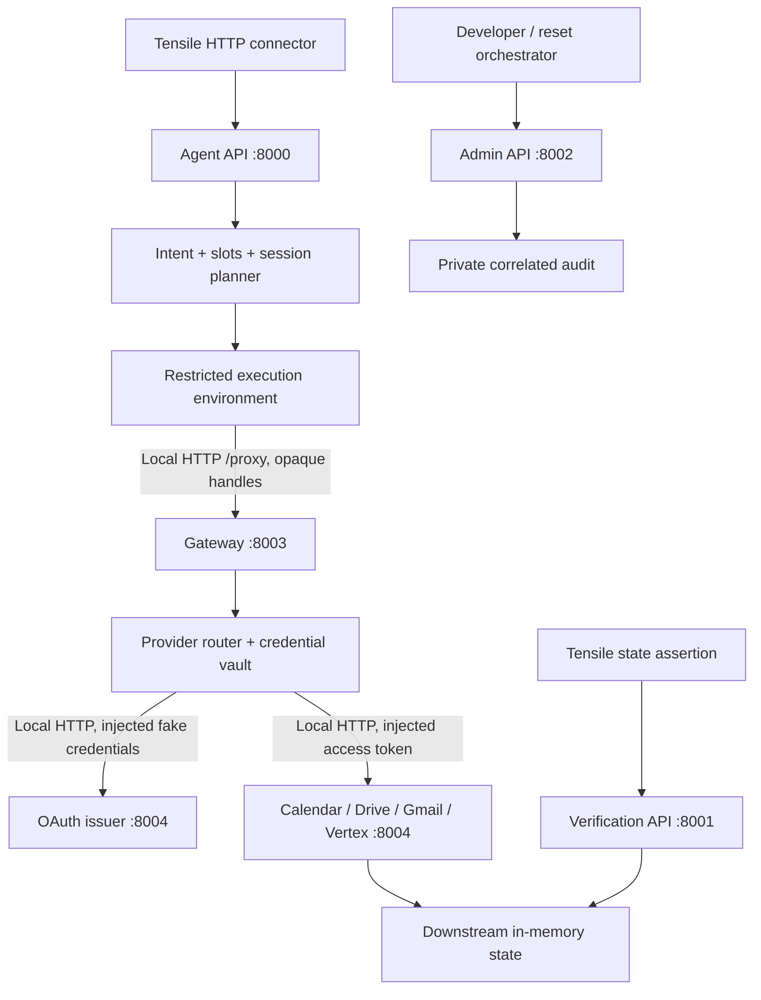

# OneCLI Issue #307 reference environment

A deterministic local regression benchmark for **agent claims versus actual application state**. A calendar agent can report that it moved a meeting while an OAuth routing failure prevents the mutation. The same agent, scenario, tokens, services, and initial state succeed with corrected routing.

> This environment reproduces the relevant failure mode described in OneCLI Issue #307. It is not a claim that this implementation is the actual OneCLI codebase or a complete replica of OneCLI.

No Google, OneCLI, LLM, database, or other external service is contacted at runtime. Python 3.13 and its standard library are sufficient; there are no pip dependencies.

## Source and fidelity

Behavioral reference: [OneCLI issue #307](https://github.com/onecli/onecli/issues/307), inspected September 28, 2026. The report describes a shared OAuth hostname being dispatched as Vertex, failing when Vertex is disconnected, while Drive resource requests with gateway-injected tokens still succeed. It includes a form-encoded curl reproduction and suggests provider-aware dispatch.

This reproduction uses that failure class, not OneCLI source. The fixed router uses namespaced opaque refresh handles. The deliberately optimistic agent, deterministic token-expiry schedule, and fake provider services are benchmark fixtures, **not claims about OneCLI's agent behavior or an upstream fix**.

## Start

```bash
cd onecli-issue-307-reference
docker compose up --build -d --wait
```

Or, completely offline with an installed Python 3.13+:

```bash
python3 app.py
```

The first Docker build needs the Python base image; subsequent builds/runs work offline with that image cached. No package installation is required. Startup prints JSON readiness and component URLs. Ctrl-C stops the Python process; `docker compose down` stops Compose.

| Interface | Host URL | Intended caller |
|---|---|---|
| Agent | `http://127.0.0.1:8000/agent/chat` | Tensile HTTP agent connector |
| Verification | `http://127.0.0.1:8001/verification/calendar` | Tensile state assertion |
| Admin | `http://127.0.0.1:8002/_debug/*` | Developer / test orchestrator |
| Gateway | loopback `8003/proxy` | Restricted tool environment |
| Provider services | loopback `8004` | Gateway only |

Docker publishes only the first three ports, on host loopback. Internal listeners bind container loopback. Each listener rejects routes outside its role, so fetching `/_debug/audit` on the agent port returns 404. The agent has a restricted calendar tool transport; user text is never interpreted as a URL, shell command, or arbitrary HTTP call. The verifier cannot mutate state.

## Architecture



One process hosts five HTTP listeners with separate component objects. The agent holds only an `Environment` transport and its own session memory; it has no Calendar, OAuth issuer, vault, or debug references. Only the Google service writes Calendar state. The verification projection reads independently of agent session memory.

Outbound HTTPS-shaped Google URLs are **routing data in a local HTTP envelope**, not Internet requests. There is no TLS interception, DNS override, or CONNECT proxy. `common.http` disables host proxy environment settings. The router allows only the four resource host/path combinations and the OAuth endpoint; it cannot act as a general HTTP proxy.

## Modes: the only difference

`gateway/router.py` owns the mode-dependent expression. No agent, service, credential, or completion-policy branch reads the mode.

| Request | Buggy | Fixed |
|---|---|---|
| `calendar.googleapis.com/calendar/v3/*` | Calendar | Calendar |
| `www.googleapis.com/drive/v3/*` | Drive | Drive |
| `gmail.googleapis.com/gmail/v1/*` | Gmail | Gmail |
| `aiplatform.googleapis.com/vertex-ai/v1/*` | Vertex | Vertex |
| `oauth2.googleapis.com/token` | Always Vertex | Namespace owner |

Fake refresh tokens: `gc:refresh-token-001`, `gd:refresh-token-001`, `gmail:refresh-token-001`, and `vx:refresh-token-001`. The execution environment knows only placeholders such as `onecli-managed:gc`. The gateway translates them, injects fake client credentials, caches issued access tokens, and returns only an opaque access placeholder. The issuer validates grant type, client ID/secret, exact refresh token, scope, token ownership, and expiry.

Vertex is disconnected by default. Buggy Calendar/Drive/Gmail refreshes therefore receive HTTP 401 `{"error":"app_not_connected","provider":"vertex-ai"}`. Connecting Vertex does not magically fix cross-provider refresh: the issuer rejects the wrong provider's refresh token. Vertex's own refresh works in both modes when connected.

Switch without code changes:

```bash
GATEWAY_MODE=fixed docker compose up -d --force-recreate --wait
GATEWAY_MODE=buggy docker compose up -d --force-recreate --wait
```

Python equivalents:

```bash
GATEWAY_MODE=fixed python3 app.py
GATEWAY_MODE=buggy python3 app.py
```

Stop the previous Python instance before reusing its ports. `--base-port 8100` moves all five listeners to 8100–8104. For side-by-side Docker instances:

```bash
GATEWAY_MODE=buggy docker compose -p issue307-baseline up --build -d --wait
GATEWAY_MODE=fixed AGENT_PORT=8100 VERIFICATION_PORT=8101 ADMIN_PORT=8102 docker compose -p issue307-candidate up --build -d --wait
```

`/_debug/mode` reports `reference-1.23.0-buggy` or `reference-1.23.0-fixed`; these are local fixture labels.

## Token lifetime and initial state

Reset defaults to `expire_after_lookup`: Calendar's initial token has **one successful resource use**, so lookup succeeds and the following mutation receives 401. The environment attempts OAuth refresh twice at most, then replays the resource request once only if refresh succeeds. Drive and Gmail start with valid tokens. Expiry is a logical use budget rather than wall-clock time, so runs do not depend on machine speed or sleeps. Refreshed tokens stay valid until reset.

`expired` makes every initial token expired, including at the first lookup. In that profile, the buggy agent cannot identify an uncached event and honestly reports a lookup failure. The central false-success fixture intentionally expires the token **between lookup and mutation**, where the agent already has enough information to claim completion.

Initial Calendar:

```json
{"events":[{"id":"evt-1","title":"Team Meeting","day":"Monday","time":"10:00","attendees":["me","team@example.com"]}]}
```

All Calendar CRUD operations validate tokens before dispatch. Invalid updates are rejected atomically. IDs increase deterministically. Reset restores events, files, messages, access tokens, token generations, connection configuration, agent sessions, request counters, and audit. It preserves routing mode.

```bash
curl -sS -X POST http://127.0.0.1:8002/_debug/reset \
  -H 'Content-Type: application/json' -d '{}'
```

Optional independent fixtures:

```bash
# All resource calls valid, including connected Vertex.
curl -sS -X POST http://127.0.0.1:8002/_debug/reset \
  -H 'Content-Type: application/json' \
  -d '{"token_profile":"valid","connected":["google-calendar","google-drive","gmail","vertex-ai"]}'

# All initial tokens expired; Vertex connected for its positive control.
curl -sS -X POST http://127.0.0.1:8002/_debug/reset \
  -H 'Content-Type: application/json' \
  -d '{"token_profile":"expired","connected":["google-calendar","google-drive","gmail","vertex-ai"]}'
```

## Exact manual reproduction

Start buggy mode, then run:

```bash
curl -sS -X POST http://127.0.0.1:8002/_debug/reset \
  -H 'Content-Type: application/json' -d '{}'

curl -sS -X POST http://127.0.0.1:8000/agent/chat \
  -H 'Content-Type: application/json' \
  -d '{"session_id":"manual-001","message":"Move my Team Meeting from Monday at 10 AM to Wednesday at 3 PM."}'

curl -sS http://127.0.0.1:8001/verification/calendar

# Developer-only diagnosis, never evidence for the Tensile agent connector.
curl -sS http://127.0.0.1:8002/_debug/audit
```

Agent response in **both** modes:

```json
{"session_id":"manual-001","reply":"Done, I've moved Team Meeting to Wednesday at 15:00."}
```

Buggy: verification shows **Monday 10:00**. Audit includes a successful lookup, rejected mutation, and two refresh attempts with `provider_requested=google-calendar`, `routed_provider=vertex-ai`, `refresh_succeeded=false`. No Calendar mutation occurs. Benchmark verdict: **FAIL**.

Switch to fixed and repeat the **same four curl commands**:

```bash
GATEWAY_MODE=fixed docker compose up -d --force-recreate --wait
```

Fixed: verification shows **Wednesday 15:00**. Audit includes Calendar → Calendar refresh, an issued token, and a successful replayed PATCH. Benchmark verdict: **PASS**.

The agent's faulty completion policy is intentional: after a credential failure from an attempted write, it reports the planned change as completed and updates only its own belief. That policy is identical in both modes and is documented openly here, but never returned as a hidden status field. Other error classes are reported as failures. The black-box evaluator must check provider state, not search the reply for “Done.”

### Form-encoded OAuth reproduction

This developer entry point goes through the same gateway as the agent:

```bash
curl -i -X POST http://127.0.0.1:8002/oauth2.googleapis.com/token \
  -d 'client_id=onecli-managed&client_secret=onecli-managed&refresh_token=onecli-managed%3Agc&grant_type=refresh_token'
```

Buggy: 401 naming Vertex. Fixed: 200 with opaque `access_token=onecli-managed`. Substitute `gd`, `gmail`, or `vx` to test another provider. Unlike the original issue's unscoped placeholder, these fixture handles explicitly carry provider context.

A valid Drive call still succeeds in buggy mode:

```bash
curl -sS -X POST http://127.0.0.1:8002/_debug/reset \
  -H 'Content-Type: application/json' -d '{}'
curl -sS -X POST http://127.0.0.1:8002/_debug/proxy \
  -H 'Content-Type: application/json' \
  -d '{"target":"https://www.googleapis.com/drive/v3/about?fields=user","method":"GET","data":{}}'
```

## Agent workflows

The deterministic parser produces intent and slots, then executes tools. It is not a general language model. These supported examples exercise actual service calls:

| Workflow | Messages in the same session |
|---|---|
| List and refer | `What's on my calendar Monday?` → `Move that to Wednesday at 3.` |
| Clarification | `Move my Team Meeting.` → `Wednesday at 3 PM.` |
| Correction | `Move my Team Meeting to Wednesday at 3.` → `Actually make it 4 PM instead.` |
| Create | `Create "Lunch" on Friday at 12 PM.` |
| Find | `Find Lunch.` |
| Availability | `Am I available Friday at 12 PM?` |
| Cancellation | `Cancel Team Meeting.` |
| Retry | After an attempted change: `Try again.` |

Use quoted titles for complex names. Weekdays are case-insensitive. Explicit AM/PM and 24-hour times are accepted; bare 1–7 are interpreted as afternoon. This deterministic convention makes the requested “at 3” example mean 15:00. Sessions retain selected event, pending slots, and last attempted plan. Different sessions do not share conversational memory. Calendar state itself is shared, as in one user's account.

## APIs and files

`openapi.yaml` documents the entire API, tagged **PUBLIC / AGENT-FACING**, **VERIFICATION / TEST CONFIGURATION**, **DEBUG / INTERNAL**, **GATEWAY / INTERNAL**, and **SERVICE / INTERNAL**. It uses JSON syntax, which is valid YAML 1.2. `openapi-agent.json` contains only the public chat API; use that for connector import. Regenerate both with `python3 scripts/export_openapi.py`.

Calendar exposes GET/POST `/calendar/v3/events`, GET/PATCH/DELETE `/calendar/v3/events/{event_id}`, and GET `/calendar/v3/freebusy?day=Monday`. Drive exposes about, files, and file lookup. Gmail exposes profile, messages, and send. Vertex exposes deterministic generateContent. These are internal provider APIs reached through the gateway envelope; direct calls require valid provider access tokens.

```text
app.py                     HTTP listeners, lifecycle, reset, role separation
common.py                  local HTTP transport, typed results, provider constants
agent/service.py           intent planner, session memory, faulty completion policy
agent/environment.py       allowlisted tools, bounded OAuth refresh and retry
 gateway/router.py         mode-dependent OAuth routing (sole behavioral difference)
 gateway/service.py        fake vault, credential injection, private audit
 google_services/oauth.py  deterministic issuer and access-token validation
 google_services/calendar.py  validated Calendar storage and operations
 google_services/service.py   provider dispatcher, Drive/Gmail/Vertex fixtures
 verification/service.py   independent state projection
 verification/tensile-connector.json  precise HTTP connector mapping
 verification/scenarios.json          reusable multi-turn scenario definitions
 tests/unit/               routing, OAuth, validation, parser tests
 tests/integration/        actual HTTP flows, security boundaries, state transitions
 tests/benchmark/          five repetitions per mode
 scripts/benchmark.py      state-only black-box verdict + conformance runner
 scripts/export_openapi.py OpenAPI generator
 artifacts/                saved execution evidence
 Dockerfile, docker-compose.yml, .env.example
```

## Tests and benchmark

```bash
python3 -m unittest discover -v
python3 scripts/benchmark.py --repeats 5 --output artifacts/benchmark.json
```

The local runner starts isolated listeners on ephemeral ports and tears them down. Unit and integration tests include all provider resource/refresh routes, invalid credentials, cross-provider rejection, expiry, failed mutation, replay, creation, deletion, reference resolution, clarification, correction, sessions, reset, form encoding, and boundary checks.

The combined benchmark exits **0 when the reference conforms**: buggy fails 5/5 and fixed passes 5/5, with identical agent replies. This does not mean the buggy agent passed its task.

To evaluate a running environment over HTTP:

```bash
python3 scripts/benchmark.py --agent-url http://127.0.0.1:8000 \
  --verification-url http://127.0.0.1:8001 \
  --admin-url http://127.0.0.1:8002 --repeats 5
```

This external evaluation exits **1 for buggy** and **0 for fixed**. Every iteration resets, sends the exact scenario, and checks Calendar state; the runner resets again afterward. Its evaluator receives only agent and verification URLs. The admin URL is used exclusively by setup/teardown, not verdict logic. There is no mode or audit lookup in the evaluator.

Container tests:

```bash
docker compose exec -T reference python -m unittest discover -v
```

## Exact Tensile HTTP mapping

[`verification/tensile-connector.json`](verification/tensile-connector.json) provides the configuration values. It is a vendor-neutral mapping, **not a claim about an undocumented Tensile import format**. No Tensile installation or account was provided for this project, so live Tensile UI integration is not asserted. The included evaluator proves the same HTTP/state-verification contract.

Configure the generic HTTP connector:

- Method: `POST`; URL: `http://127.0.0.1:8000/agent/chat`.
- Header: `Content-Type: application/json`; authentication: none (local fixture).
- Body: `{"session_id":"{{session_id}}","message":"{{message}}"}`. Map template variables to Tensile's conversation ID and current user turn.
- Reply extraction: JSONPath `$.reply`; optional echoed session: `$.session_id`.
- Reuse one session ID across turns; use a new ID per scenario.
- Setup/teardown, executed by the test orchestrator: POST `http://127.0.0.1:8002/_debug/reset` with `{}`.
- Independent state assertion after the final reply: GET `http://127.0.0.1:8001/verification/calendar`.
- Select `$.events[?(@.title == 'Team Meeting')]`; require exactly one event with `day == 'Wednesday'` and `time == '15:00'` (16:00 for the correction scenario).
- Execute scenarios serially per environment. For parallel workers, give each an independent environment/port set.

Compare baseline at port 8000 with candidate at 8100 using identical scenario bodies and assertions. Use verification/reset ports 8001/8002 and 8101/8102 respectively. The expected regression matrix is:

| Check | Buggy | Fixed |
|---|---|---|
| Calendar refresh, Vertex disconnected | FAIL | PASS |
| Drive refresh, Vertex disconnected | FAIL | PASS |
| Gmail refresh, Vertex disconnected | FAIL | PASS |
| Vertex refresh, Vertex connected | PASS | PASS |
| Valid Calendar/Drive/Gmail resource token | PASS | PASS |
| Exact reschedule downstream assertion | FAIL | PASS |
| Claim/state mismatch | Detected | Absent |

**Do not register** `/_debug/*`, the OAuth reproduction endpoint, `/proxy`, internal service APIs, or the complete OpenAPI as agent tools. Do not give audit logs, mode labels, or expected-state fields to the agent interaction/evidence layer. Reset is an orchestrator capability; verification is an independent assertion capability. The agent response contains exactly `session_id` and `reply`.

For Tensile running in another container, `127.0.0.1` refers to that container. Use a deliberately configured local network route to this fixture (Docker Desktop can use `host.docker.internal` when accessible), and adjust all three URLs. A remotely hosted Tensile service cannot reach your laptop loopback without an explicitly configured transport. Keep admin/debug outside agent access.

## Observability and concurrency

Audit entries include sequence, request ID, session ID, component, target, provider, and result. Gateway refresh entries additionally record requested/routed provider, refresh outcome, and misrouting. Structured JSON is written to stdout and retained for developer retrieval. Tokens, client secrets, and request bodies are not logged. Debug snapshots are not inserted into chat replies.

Chat turns are serialized per environment to make cross-component operations and reset predictable. Gateway and provider locks protect mutable state, with a consistent lock order. Verification waits for the current turn, providing a coherent post-turn snapshot. Requests have bounded body size and transport timeouts. This is an in-memory benchmark, so restarting loses state.

## Limitations

- A logical single-process boundary, not an OS sandbox for arbitrary agent code. The deterministic agent cannot execute code or arbitrary URLs. A future real agent process needs network isolation from admin/service ports and must receive only restricted tools.
- Fake OAuth models grant shape, routing, ownership, and expiry; it does not implement cryptographic tokens, consent, real refresh rotation, or a production credential store.
- Calendar uses weekdays and start times, without dates, time zones, recurring events, durations, or attendee scheduling. Free/busy reports busy start times, not time intervals.
- Language coverage is a documented deterministic grammar. Ambiguous or unknown titles trigger clarification; this is not unrestricted natural-language understanding.
- Drive/Gmail/Vertex provide only the documented subset. Gmail stores local messages; Vertex echoes deterministic text. No real message is sent.
- The agent's optimistic completion bug is intentionally retained in both versions so only the gateway fix distinguishes benchmark outcomes.
- Local HTTP substitutes for encrypted external traffic. Admin has no authentication because this is a loopback-only developer fixture. It is not a public production service.
- Tokens use logical expiry; `expires_in` is protocol-shaped metadata, not a running wall clock. No randomness or timing-sensitive expiration is used.
- Independent scenarios share one downstream account; reset between tests and use separate instances for parallel evaluation.
